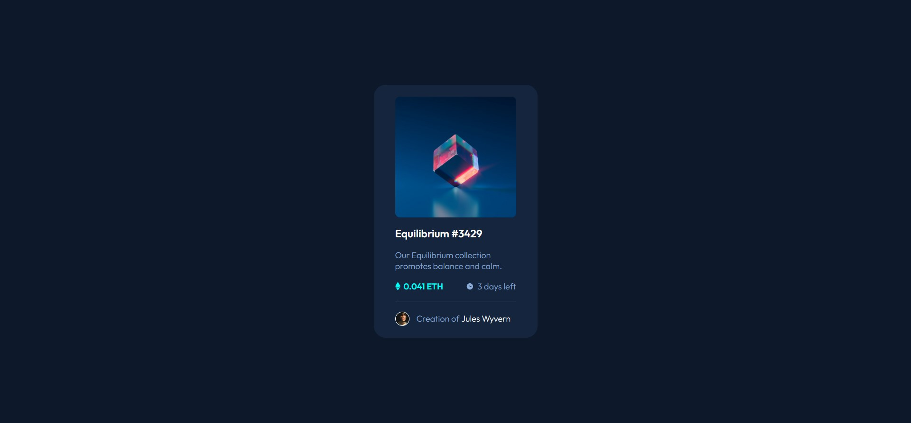

# Frontend Mentor - NFT preview card component solution

This is a solution to the [NFT preview card component challenge on Frontend Mentor](https://www.frontendmentor.io/challenges/nft-preview-card-component-SbdUL_w0U). Frontend Mentor challenges help you improve your coding skills by building realistic projects.

## Table of contents

- [Overview](#overview)
  - [The challenge](#the-challenge)
  - [Screenshot](#screenshot)
  - [Links](#links)
- [My process](#my-process)
  - [Built with](#built-with)
  - [What I learned](#what-i-learned)
- [Author](#author)

## Overview

### The challenge

Users should be able to:

- View the optimal layout depending on their device's screen size
- See hover states for interactive elements

### Screenshot



### Links

- Solution URL: [https://github.com/DamonTham/NFT-preview-card-component](https://github.com/DamonTham/NFT-preview-card-component)
- Live Site URL: [https://damontham.github.io/NFT-preview-card-component/](https://damontham.github.io/NFT-preview-card-component/)

## My process

### Built with

- Semantic HTML5 markup
- CSS custom properties
- Flexbox

### What I learned

```html
<div class="nft-image">
  
  <div class="hover-image">
    
  </div>
</div>
```

```css
.nft-image {
  border-radius: 10px;
  overflow: hidden;
  position: relative;
}

.nft-image img {
  width: 100%;
  display: block;
}

.hover-image {
  position: absolute;
  top: 0;
  left: 0;
  width: 100%;
  height: 100%;
  background-color: hsla(178, 100%, 50%, 0.5);
  opacity: 0;
  transition: opacity 0.2s ease-in-out;
}

.hover-image img {
  position: absolute;
  width: 50px;
  top: 50%;
  left: 50%;
  transform: translate(-50%, -50%);
}
```

<!-- ```js
const proudOfThisFunc = () => {
  console.log("🎉");
};
``` -->

## Author

- Frontend Mentor - [@DamonTham](https://www.frontendmentor.io/profile/DamonTham)
